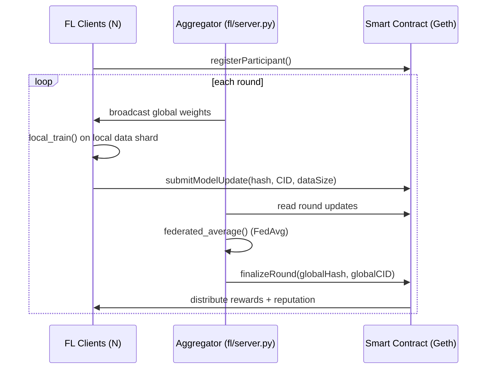

# Federated Learning on Blockchain

A working demo that combines **privacy-preserving federated learning** with an
**Ethereum smart contract** that coordinates rounds, records tamper-evident
commitments of every model update, and pays out rewards -- built as a
reference implementation / starting point for thesis and research work in
this area.

## Why blockchain + federated learning?

Federated learning already avoids moving raw data off each participant's
machine. What it doesn't solve on its own is **coordination trust**: who
verifies a participant actually submitted an update, who decides a round is
complete, and who is accountable for rewarding honest contributors. This
project replaces that centralized trust with a smart contract:

- Every submitted model update is committed on-chain as a hash + off-chain
  pointer (e.g. an IPFS CID) -- verifiable and tamper-evident, without ever
  putting raw weights on-chain.
- Round completion, aggregation triggers, and reward payouts are enforced by
  contract logic instead of a single trusted server.
- Each participant accumulates an on-chain reputation score across rounds.

## Architecture



## Project structure

```
.
├── contracts/FederatedLearning.sol   # round lifecycle, commitments, rewards
├── fl/
│   ├── model.py                      # PyTorch CNN
│   ├── client.py                     # local training + weight hashing
│   ├── server.py                     # FedAvg aggregation
│   └── data_utils.py                 # MNIST loading + IID / non-IID partitioning
├── blockchain/
│   ├── compile.py                    # solc via py-solc-x
│   ├── deploy.py                     # deploy to Geth via Web3.py
│   └── interface.py                  # Web3.py contract wrapper
├── scripts/
│   ├── start_geth_dev.sh             # local Geth dev node
│   └── run_simulation.py             # end-to-end demo (N clients, M rounds)
├── tests/
│   ├── test_fl.py                    # FedAvg unit tests
│   └── test_contract.py              # contract integration tests
└── docs/architecture.md              # design rationale + extension ideas
```

## Tech stack

| Layer | Tool |
|---|---|
| ML | PyTorch, torchvision |
| FL algorithm | FedAvg (McMahan et al., 2017), IID / non-IID partitioning |
| Blockchain client | Geth (`--dev` mode for local testing) |
| Smart contract | Solidity ^0.8.19 |
| Chain <-> Python bridge | Web3.py, py-solc-x |

## Setup

```bash
python -m venv .venv && source .venv/bin/activate
pip install -r requirements.txt
```

Install Geth: https://geth.ethereum.org/docs/getting-started/installing-geth

## Running the demo

```bash
# terminal 1
./scripts/start_geth_dev.sh

# terminal 2
cp .env.example .env
python -m scripts.run_simulation
```

This deploys the contract, registers `NUM_CLIENTS` simulated participants,
then runs `NUM_ROUNDS` of federated learning: each client trains locally on
its own MNIST shard, submits a commitment on-chain, the server runs FedAvg,
and the round is finalized on-chain with rewards distributed automatically.

## Tests

```bash
python -m pytest tests/test_fl.py        # no blockchain needed
./scripts/start_geth_dev.sh &
python -m pytest tests/test_contract.py  # needs a running node
```

## Adapting this for a specific thesis

The MNIST/CNN pair is a stand-in so the whole pipeline runs on CPU with a
one-line dataset download. Swapping in a different model (`fl/model.py`) and
dataset (`fl/data_utils.py`) -- e.g. a tabular healthcare or fraud dataset --
is enough to point the exact same coordination/blockchain layer at a
different domain. See `docs/architecture.md` for further extension ideas
(secure aggregation, differential privacy, reputation-weighted rewards).

## License

MIT -- see [LICENSE](LICENSE).
